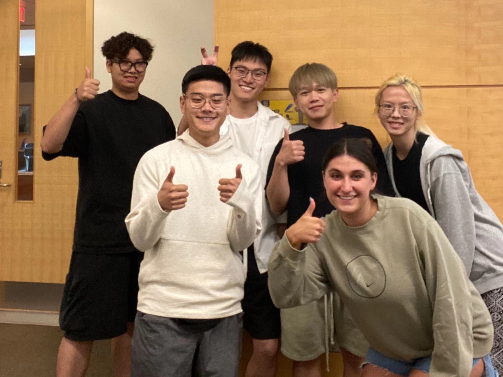

# About Us

Hi! We are Team 4Ward! Excited to meet you all! Before our journey to the guidance, we would like to introduce ourselves to you, and of course, if you have any questions about this guidance, don't hesitate to contact us! 

Fig.2 Team 4WARD

## Joe (Yuzhou) Zhai

Hi! I'm Joe(Yuzhou) Zhai, from Shanghai, China. I'm a Graduate student majoring in Business Analytics at University of Michigan - Stephen M. Ross School of Business. I Graduated from Shanghai Jiao Tong University, majoring in Electrical and Computer Engineering, with a minor in Data Science. I'm an Energetic and creative student leader with proven abilities of managing large teams and organizing events. I am Deeply passionate about studying and leveraging data analytical skills to unravel key answers from large, varied and complex datasets in business intelligence field.

Fig.2.1 Joe Zhai

Contact me!

LinkedIn: www.linkedin.com/in/yuzhou-zhai

Email: zaptain@umich.edu

Tel: (734)355-2166

## Andy Chen

What’s up everyone! I’m Andy Chen and I was born and raised in the Bay Area in Foster City, California. I recently graduated with a Bachelor of Arts in Economics from the University of Michigan and am currently a Master of Business Analytics student at the Ross School of Business. I chose to pursue a degree in Business Analytics as I wished to supplement the theoretical knowledge I gained from my Economics degree with stronger data analytics skills.

Outside of school I enjoy spending time with friends. Back home we often go fishing at Bass Lake, and, although I haven’t gone yet in Michigan, I would love to sometime this year. I have a dog named Aaron and he is a Cavalier King Charles Spaniel; he’s a good dog. I am also an avid fan of professional poker strategy and love watching/playing the game. 

Fig.2.2 Andy Chen

Contact Me!

LinkedIn: https://www.linkedin.com/in/andy-chen-211835173/

Email: chenandy@umich.edu

Tel: (650)245-3987

## Max (Hongli) Xuan

My name is Hongli Xuan(I can also go by Max!) and I am a master student majoring in Business Analytics. I am originally from Zhejiang, China and have been studying abroad since 2017. My undergraduate year was pursued at the University of Oregon. I am interested in the consulting industry, especially the strategy department. 

Fig.2.3 Max Xuan

Contact me!

LinkedIn: https://www.linkedin.com/in/hongli-xuan-73159b198/ 

Email: hxuan@umich.edu

Tel: (458)201-9947

## Jimmy (Hao) Zhou

My name is Jimmy Zhou and I am from China. I just graduated from Penn State University in May 2022, majoring in Finance with a minor in Information System Management. I am currently pursuing a Master of Business Analytics at University of Michigan Ross School of Business.

Fig.2.4 Jimmy Zhou

Contact Me!

LinkedIn: https://www.linkedin.com/in/hao-jimmy-zhou-bb30401a3/

Email: jimmyzh@umich.edu

Tel: (814)330-0637

## Natalie Lobo

Hello, my name is Natalie Lobo and I am from Pebble Beach, CA. I am currently pursuing a Masters of Business Analytics at the Ross School of Business. In May of 2022, I graduated from the University of Wisconsin- Madison and received a Bachelors of Science in Life Sciences Communication with certificates in Business and Digital Studies. Over the last five years, I have become very interested in Data Analytics and Marketing. I was exposed to these fields during my internship at Carbon Medical Technologies, Inc., where I I was tasked with developing the company’s digital presence. In my free time I love to cook and workout. I currently run my own food account (https://www.instagram.com/munchiesbynatalie). 

Fig.2.5 Natalie Lobo

Contact Me!

LinkedIn: https://www.linkedin.com/in/natalie-lobo-7117901a3/

Email: natalie.k.lobo@gmail.com 

Tel: (831)717-7204 

## Qianyu Yang

My name is Qianyu Yang and I am from Shanghai, China. I just graduated from The Ohio State University, majoring in Finance. I am currently pursuing a Master of Business Analytics at University of Michigan Ross School of Business.

Fig.2.6 Qianyu Yang

Contact Me!

LinkedIn: www.linkedin.com/in/qianyu-yang-0144b7195

Email: lokiyang@umich.edu

Tel: (614)432-6199

