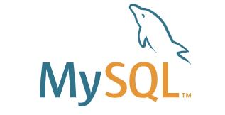
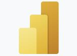

# Analytics Toolbox

Before diving into deeper discussion of effective communication, here is a prerequisite reading for you to read through. In order to communicate effectively with career professions, recruiters, and interviewers, you first need to figure out all these professional terms.

In this section, we will provide a dictionary to explain professional terms frequently being used in analytical fields in detail and provide you with relevant website link for more information, including **installation guiding** and **online tutorial resources**. Hopefully you can communicate with career professions, recruiters, and interviewers effectively after reading the information provided in this dictionary!

## Common Tools and Terms {#Common}

In this section, there will be several common tools as well as terms for you to read through. You can click the graph after the installation instruction to install the tools you may need.

### Anaconda {#Anaconda}

Anaconda is an integrated platform. You can have a jump start of your trip of analytics with Anaconda. It offers the easiest way to perform Python/R data science and machine learning on a single machine with rich packages. Start working with thousands of open-source packages and libraries today!

Related terms: \@ref(py), \@ref(R)

Installation:

### Python{#py}

Python is a widely used general-purpose, high level programming language. It was created by Guido van Rossum in 1991 and further developed by the Python Software Foundation. It was designed with an emphasis on code readability, and its syntax allows programmers to express their concepts in fewer lines of code.

Easy Installation:

Official Installation:

[Free Online Python Tutorial](https://www.udacity.com/course/introduction-to-python--ud1110)

### R {#R}

R is a language and environment for statistical computing and graphics. R provides a wide variety of statistical (linear and nonlinear modelling, classical statistical tests, time-series analysis, classification, clustering, …) and graphical techniques, and is highly extensible. The S language is often the vehicle of choice for research in statistical methodology, and R provides an Open Source route to participation in that activity.

Easy Installation:

  + Step 1:  

  + Step 2: Open Anaconda Prompt
  
  + Step 3: Type "conda install r"

Official Installation: 

[Online R Programming Tutorial](https://www.coursera.org/learn/data-analysis-r)

### SQL (MySQL) {#SQL}

SQL, Structured Query Language) is a domain-specific language used in programming and designed for managing data held in a relational database management system (RDBMS), or for stream processing in a relational data stream management system (RDSMS). It is particularly useful in handling structured data, i.e. data incorporating relations among entities and variables.

MySQL
MySQL is an open-source relational database management system (RDBMS). Its name is a combination of "My", the name of co-founder Michael Widenius's daughter My, and "SQL", the abbreviation for Structured Query Language. A relational database organizes data into one or more data tables in which data may be related to each other; these relations help structure the data.

Installation:

[Free Online SQL Tutorial](https://www.udacity.com/course/sql-for-data-analysis--ud198)

### Microsoft Excel{#MSX}
Microsoft Excel is a spreadsheet developed by Microsoft for Windows, macOS, Android and iOS. It features calculation or computation capabilities, graphing tools, pivot tables, and a macro programming language called Visual Basic for Applications (VBA). Excel forms part of the Microsoft Office suite of software.

Key terms you may encounter: 

  + [VLOOKUP](https://support.microsoft.com/en-us/office/vlookup-function-0bbc8083-26fe-4963-8ab8-93a18ad188a1)
  
  + [Power Query](https://docs.microsoft.com/en-us/power-query/power-query-what-is-power-query)
  
  + [VBA](https://docs.microsoft.com/en-us/office/vba/library-reference/concepts/getting-started-with-vba-in-office)
  
  + [Pivot Table](https://support.microsoft.com/en-us/office/create-a-pivottable-to-analyze-worksheet-data-a9a84538-bfe9-40a9-a8e9-f99134456576)

[Free Download for students](https://www.microsoft.com/en-us/education/products/microsoft-365)

### Data Visualization

Data visualization is the practice of translating information into a visual context, such as a map or graph, to make data easier for the human brain to understand and pull insights from. The main goal of data visualization is to make it easier to identify patterns, trends and outliers in large data sets.

Useful data visualization tools:

  + Microsoft Excel \@ref(MSX)
  + Tableau \@ref(TB)
  + Power BI \@ref(BI)
  + Python (Matplotlib, Seaborn) \@ref(py)

## Business Analytics
Business analytics (BA) is a set of disciplines and technologies for solving business problems using data analysis, statistical models and other quantitative methods. It involves an iterative, methodical exploration of an organization's data, with an emphasis on statistical analysis, to drive decision-making.

### Market Analysis

A market analysis can help you identify how to better position your business to be competitive and serve your customers.

And you can find more instructions [here](https://www.coursera.org/articles/market-analysis)

Common analysis pattern you may use:

  + [PEST](https://www.coursera.org/articles/market-analysis)
  + [PESTLE](https://pestleanalysis.com/what-is-pestle-analysis/)
  + [STEEPLE](https://planningtank.com/market-research/steeple-analysis#:~:text=STEEPLE%20is%20an%20advanced%20analysis,%2C%20Political%2C%20Legal%20and%20Ethical.)

### Business Model

The term business model refers to a company's plan for making a profit. It identifies the products or services the business plans to sell, its identified target market, and any anticipated expenses. Business models are important for both new and established businesses.

Useful [website](https://businessmodelanalyst.com/) for you to see some examples of business model. There are 9 components in a business model:

  + Key Partners
  + Key Activities
  + Key Resources
  + Value Propositions
  + Customer Relationship
  + Channels
  + Customer Segments
  + Cost Structure
  + Revenue Streams
  
### CBAP

CBAP stands for Certified Business Analysis Professional. This certification is the title given to professionals who sit for and pass the CBAP exam.

You can obtain more information [here](https://www.globalknowledge.com/us-en/training/certification-prep/topics/business-analysis/section/cbap-certification/cbap/).

### Consultant
A consultant is a professional (also known as expert, specialist, see variations of meaning below) who provides advice and other purposeful activities in an area of specialization.

Consulting services generally fall under the domain of professional services.

The role of consultant outside the medical sphere (where the term is used specifically for a grade of doctor) can fall under one of two general categories:

  + Internal consultant: Someone who is either employed by or contracted by a client organization, and operates within a client-organization (maybe as part of an internal consultancy unit); or
  + External consultant: Someone who is employed externally to the client (either by a consulting firm, some other agency or as an independent freelancer), whose expertise is provided as part of a contract for a fee or rate.

### Power BI{#BI}

Power BI is an interactive data visualization software product developed by Microsoft with a primary focus on business intelligence.[1] It is part of the Microsoft Power Platform. Power BI is a collection of software services, apps, and connectors that work together to turn unrelated sources of data into coherent, visually immersive, and interactive insights. Data may be input by reading directly from a database, webpage, or structured files such as spreadsheets, CSV, XML, and JSON.

Power BI Online Platform and Installation:

### Exploratory Data Analysis (EDA)

In statistics, exploratory data analysis is an approach of analyzing data sets to summarize their main characteristics, often using statistical graphics and other data visualization methods. A statistical model can be used or not, but primarily EDA is for seeing what the data can tell us beyond the formal modeling and thereby contrasts traditional hypothesis testing.

## Data Analytics

Data analytics (DA) is the process of examining data sets in order to find trends and draw conclusions about the information they contain. Increasingly, data analytics is done with the aid of specialized systems and software.

### Tableau{#TB}

Tableau Software is an American interactive data visualization software company focused on business intelligence. Tableau products query relational databases, online analytical processing cubes, cloud databases, and spreadsheets to generate graph-type data visualizations. The software can also extract, store, and retrieve data from an in-memory data engine.

Free Installation for student:

### SAS
SAS (previously "Statistical Analysis System") is a statistical software suite developed by SAS Institute for data management, advanced analytics, multivariate analysis, business intelligence, criminal investigation, and predictive analytics.

Free Installation for Students:

### SPSS
SPSS is a widely used program for statistical analysis in social science. It is also used by market researchers, health researchers, survey companies, government, education researchers, marketing organizations, data miners, and others.

[SPSS Installation for Students](https://www.ibm.com/products/spss-statistics-gradpack)

### A/B Testing
A/B testing (also known as bucket testing or split-run testing) is a user experience research methodology. A/B tests consist of a randomized experiment with two variants, A and B. It includes application of statistical hypothesis testing or "two-sample hypothesis testing" as used in the field of statistics. A/B testing is a way to compare two versions of a single variable, typically by testing a subject's response to variant A against variant B, and determining which of the two variants is more effective.

[Free Online Tutorials for A/B Testing](https://www.udacity.com/course/ab-testing--ud257)

### Machine Learning

Machine learning (ML) is a type of artificial intelligence (AI) that allows software applications to become more accurate at predicting outcomes without being explicitly programmed to do so. Machine learning algorithms use historical data as input to predict new output values.

[Free Online Tutorials for Machine Learning](https://learn.udacity.com/courses/ud262)

### Scikit Learn
Scikit-learn (formerly scikits.learn and also known as sklearn) is a free software machine learning library for the Python programming language. It features various classification, regression and clustering algorithms including support-vector machines, random forests, gradient boosting, k-means and DBSCAN, and is designed to interoperate with the Python numerical and scientific libraries NumPy and SciPy.

Some frequently-used machine learning classifier/regression models:

  + Linear Regression
  + Logistic Regression
  + RidgeCV
  + DecisionTree
  + RandomForest
  + SVM
  + KNN

### Feature Engineering

Feature engineering is the process of selecting, manipulating, and transforming raw data into features that can be used in supervised learning. In order to make machine learning work well on new tasks, it might be necessary to design and train better features. It is usually performed before using machine learning models.

### Cross-Validation

Cross-validation is a resampling method that uses different portions of the data to test and train a model on different iterations. It is mainly used in settings where the goal is prediction (e.g., machine learning models), and one wants to estimate how accurately a predictive model will perform in practice.

## Data Science

Data science is an interdisciplinary field that uses scientific methods, processes, algorithms and systems to extract knowledge and insights from noisy, structured and unstructured data, and apply knowledge from data across a broad range of application domains. Data science is related to data mining, machine learning and big data.

Data science is a "concept to unify statistics, data analysis, informatics, and their related methods" in order to "understand and analyse actual phenomena" with data. It uses techniques and theories drawn from many fields within the context of mathematics, statistics, computer science, information science, and domain knowledge.

### ETL

ETL, which stands for extract, transform, and load, is the process data engineers use to extract data from different sources, transform the data into a usable and trusted resource, and load that data into the systems end-users can access and use downstream to solve business problems.

### Data Warehouse

A data warehouse is a central repository of information that can be analyzed to make more informed decisions. Data flows into a data warehouse from transactional systems, relational databases, and other sources, typically on a regular cadence.

### Bayesian Statistics

Bayesian statistics is a theory in the field of statistics based on the Bayesian interpretation of probability where probability expresses a degree of belief in an event. The degree of belief may be based on prior knowledge about the event, such as the results of previous experiments, or on personal beliefs about the event. This differs from a number of other interpretations of probability, such as the frequentist interpretation that views probability as the limit of the relative frequency of an event after many trials.

[Online Text Book for Bayesian Data Analysis](http://www.stat.columbia.edu/~gelman/book/BDA3.pdf)

### Stochastic Process

In probability theory and related fields, a stochastic or random process is a mathematical object usually defined as a family of random variables. Stochastic processes are widely used as mathematical models of systems and phenomena that appear to vary in a random manner.

[Online Text Book for Stochastic Process](http://ramanujan.math.trinity.edu/polofsson/teach/Book.pdf)

### Natural language processing (NLP)

Natural language processing (NLP) is the ability of a computer program to understand human language as it is spoken and written -- referred to as natural language. It is a component of artificial intelligence (AI). NLP has existed for more than 50 years and has roots in the field of linguistics.

### Deep Learning

Deep learning (also known as deep structured learning) is part of a broader family of machine learning methods based on artificial neural networks with representation learning. Learning can be supervised, semi-supervised or unsupervised.

Deep-learning architectures such as deep neural networks, deep belief networks, deep reinforcement learning, recurrent neural networks, convolutional neural networks and Transformers have been applied to fields including computer vision, speech recognition, natural language processing, machine translation, bioinformatics, drug design, medical image analysis, climate science, material inspection and board game programs, where they have produced results comparable to and in some cases surpassing human expert performance.
