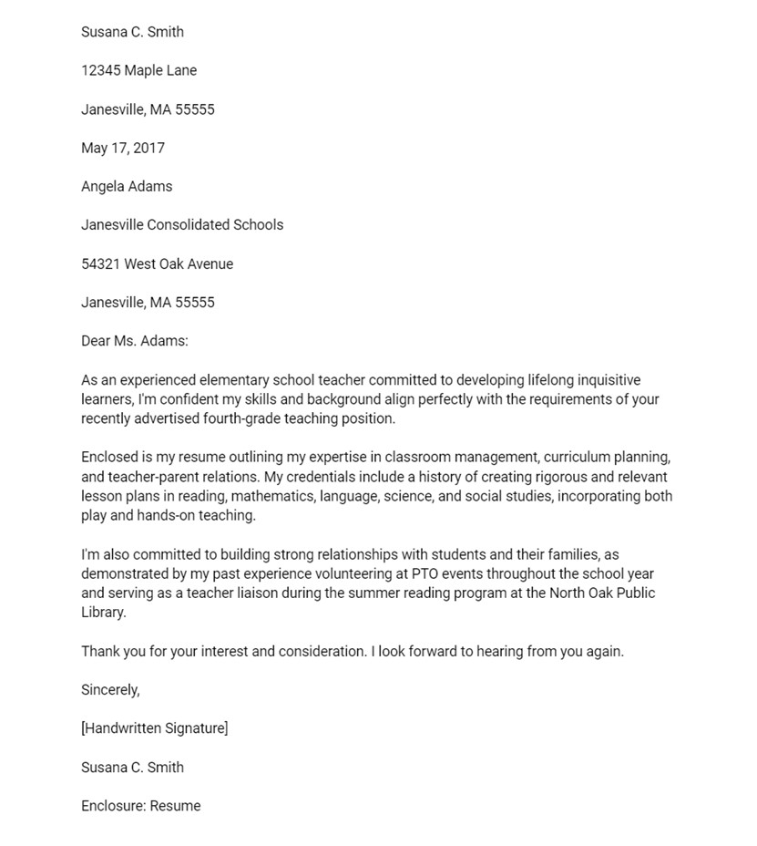
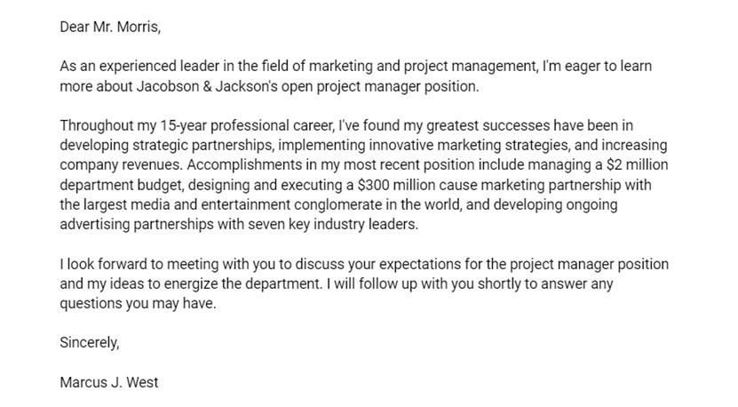
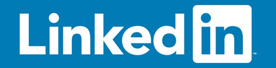

# Application Materials

## Resume
Your resume describes your qualifications and what makes you unique. To stand out among other applicants, you need a resume that markets your strengths and match for the job.
  It’s easy to create a resume that looks like everyone else’s. But to win that interview, you need to go beyond the standard approach. Here are four strategies that will get your resume noticed:

* [Sell yourself and your brand](https://www.careeronestop.org/JobSearch/Resumes/ResumeGuide/TopResumeStrategies/sell-yourself-and-your-brand.aspx)

* [Identify your transferable skills](https://www.careeronestop.org/JobSearch/Resumes/ResumeGuide/TopResumeStrategies/identify-transferable-skills.aspx)

* [Highlight your accomplishments](https://www.careeronestop.org/JobSearch/Resumes/ResumeGuide/TopResumeStrategies/highlight-your-accomplishments.aspx)

* [Applicant tracking systems](https://www.careeronestop.org/JobSearch/Resumes/ResumeGuide/TopResumeStrategies/applicant-tracking-systems.aspx)

Useful Tools:

* [Vmock](https://www.vmock.com/michiganross)

* [CDO Resume Review](https://michiganross.12twenty.com/dashboard)

## Cover Letter

Cover letters are an often overlooked part of the job-hunting process. Many of us think they're not necessary or that hiring managers don't read them. However, an eye-catching cover letter can make the difference between your job application going in the interview pile or the rejection pile. A well-written cover letter will entice a potential employer to take a closer look at your resume.

* Traditional Cover Letter
If you're submitting a printed copy of your cover letter, you should use the format of a [traditional business letter](https://grammar.yourdictionary.com/writing/how-to-write-a-letter.html). Don't forget to add a handwritten signature and note that you're enclosing a copy of your resume.

* Email Cover Letter
If you're submitting your cover letter in the body of an email, you don't need to include address information at the top or use the enclosure notation to indicate that your resume is attached to the message.

>Example: School Teacher

While an email letter is more informal, you should still write your email in a [professional tone](https://examples.yourdictionary.com/examples-of-cover-letters.html).

> Example: Project Manager

## LinkdeIn
LinkedIn is the most popular professional online platform for job seekers and businesses. Learn how to make the most of this valuable tool.

*LinkedIn is a social platform where professionals can network, search for jobs, sign up as freelancers, and publish articles.
*If you own a business, LinkedIn for Business lets you vet and hire employees and vendors, generate leads, and market your company.
*LinkedIn’s free and Premium tiers offer varied features and functionality; you can customize your membership according to how you want to use LinkedIn.

LinkedIn is a social network for the business community. Founded in 2002, the site is a place for professionals to connect with past and current colleagues, increase business connections, network within their industry, discuss business ideas, search for jobs, and look for new hires.

LinkedIn users create professional, resume-like profiles that allow other site members to learn more about their business background, areas of expertise and professional development organization memberships. Once users create a profile, they can add other users to their network.

The profiles also include status updates that let people in a user’s network know what they’re working on and when they might be traveling. There is also a feature that allows people who are not signed in to LinkedIn to view parts of a user’s public profile.

LinkedIn business profiles are for organizations seeking to hire, generate leads, grow and market their business, and more. LinkedIn also offers solutions and resources for businesses of all sizes.

We’ll explore LinkedIn’s various tools and resources for both individual professionals and businesses.

### How to display your work with LinkedIn portfolio
A LinkedIn portfolio is a featured section in your LinkedIn profile. Your portfolio contains samples of your work. People who view your profile can look through your samples to get a sense of how you perform your work.

Think about it like this: If your resume tells people what you can do, your portfolio shows it.

Here’s how to showcase your work as a portfolio on LinkedIn:

1.Sign in to LinkedIn and go to your profile. To do so, click **Me** > **View Profile**.

2.In the first box, under your name, click **Add profile section**.

3.Click **Recommended**  > **Add featured**.

4.Click the **plus sign** and select **Add a Post, Add an Article, Add a Link, or Add Media**.

5.Selecting **Add a Post** or **Add an Article** allows you to add any posts or articles you’d like to feature here.

6.To add a link to your work, select **Add a Link** and then paste the URL of the content you want to import. Add a title and description to your link and click **Save**.

7.To add media, select **Add Media** and choose the file from your computer. Add a title and description to your media and click **Save**.

